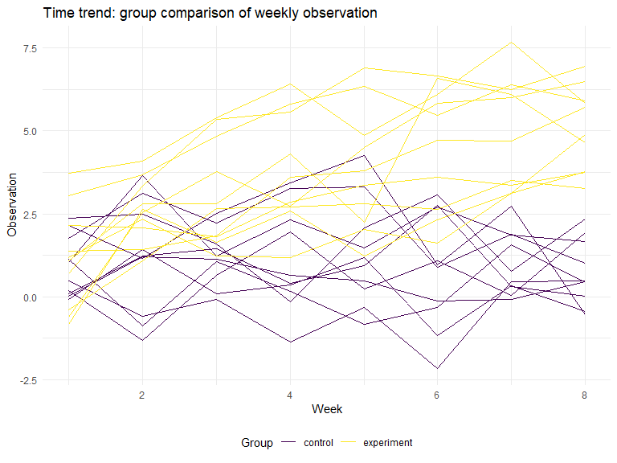

191108\_HW5
================
Gavin Ko
11/4/2019

# Problem 1

Firstly, generate the iris data with NA values.

``` r
set.seed(10)

iris_with_missing = iris %>% 
  map_df(~replace(.x, sample(1:150, 20) , NA) ) %>%
  mutate(Species = as.character(Species))
```

``` r
nasavior = function(x) {

# for numeric part
  if (is.numeric(x) == T) {
    # take the mean outside of the iteration so that it didn't constantly changes as we fill in NAs
    # rounding to 2 digits under decimal
    mean = round( mean(x, na.rm = T), digits = 2)
    
    for (i in 1:length(x)) {
      
        if (is.na(x[[i]]) == T) {
          x[[i]] = mean
        }
    }
    
# for species
  } else if (is.character(x) == T) {
    
      for (i in 1:length(x)) {
      
        if (is.na(x[[i]]) == T) {
          x[[i]] = "virginica"
        }
      }
  } else {
      stop("Error: input vector should be numeric or character.")
    }
# return the results   
  x
}
```

After we construct the `nasavior` function, we can further apply it to
the `iris_with_missing` dataset.

``` r
iris_with_missing %>% 
  map_df(~nasavior(.x))
```

    ## # A tibble: 150 x 5
    ##    Sepal.Length Sepal.Width Petal.Length Petal.Width Species
    ##           <dbl>       <dbl>        <dbl>       <dbl> <chr>  
    ##  1         5.1          3.5         1.4         0.2  setosa 
    ##  2         4.9          3           1.4         0.2  setosa 
    ##  3         4.7          3.2         1.3         0.2  setosa 
    ##  4         4.6          3.1         1.5         1.19 setosa 
    ##  5         5            3.6         1.4         0.2  setosa 
    ##  6         5.4          3.9         1.7         0.4  setosa 
    ##  7         5.82         3.4         1.4         0.3  setosa 
    ##  8         5            3.4         1.5         0.2  setosa 
    ##  9         4.4          2.9         1.4         0.2  setosa 
    ## 10         4.9          3.1         3.77        0.1  setosa 
    ## # ... with 140 more rows

# Problem 2

## Dataframe with all file names

Firstly, construct the grand framework of the whole dataset.

``` r
P2df = 
  tibble(
    file_names = list.files(path = "data")
  )
```

## Read in all the datas

``` r
# create readin function
readinfunc = function(x) {
  y = read.csv(file = str_c("data/", x), header = T)
}

# insert data into framework
P2df = P2df %>%
  mutate(
    data = map(file_names, readinfunc))
```

## Tidy the result

``` r
# unnest the inserted values 
P2df = P2df %>% 
  unnest(cols = data) %>% 
    
    # seperate the string factors and keep the information needed
    separate(col = file_names, into = c("arm", "id"), sep = "_", remove = T) %>% 
    separate(col = id, into = c("id", "trash"), sep = 2, remove = T) %>% 
  
    # rename the "arm" variable to include 
    mutate(
      subject = str_c(arm, id),
      arm = factor(arm, levels = c("con", "exp"), labels = c("control", "experiment"))
    ) %>% 
    select(subject, arm, everything(), -trash) %>%
  
    # make the "week" variable into long format
    pivot_longer(week_1:week_8, 
                names_to = "week",
                 values_to = "observation") %>% 
    separate(week, c("trash", "week"), "_", remove = T) %>% 
    
    # mutate the class of week and id into numeric
    mutate(
      week = as.numeric(week),
      id = as.numeric(id)
    ) %>% 
    select(-trash)
```

After we tidy up the data, we can plot the spaghetti.

``` r
P2df %>% 
  ggplot(aes(x = week, y = observation, group = subject, color = arm)) + 
  geom_line(aes(color = arm)) + 
  labs(
      title = "Time trend: group comparison of weekly observation",
      x = "Week",
      y = "Observation",
      color = "Group")
```



Accordingly, the general trend of observations in experiment group is
higher than those in control group. Also, there’s a general upgrowing
trend from week 1 to week 8 in experiment group, while the time trend
isn’t obvious in control group.

# Problem 3

Firstly, construct the regression function.

``` r
# set the default and function
sim_regression = function(n = 30, beta0 = 2, beta1) {
  
  sim_data = tibble(
    x = rnorm(n, mean = 0, sd = 1),
    y = beta0 + beta1 * x + rnorm(n, 0, sd = 50 ^ 0.5)
  )
  # fit in the model  
  ls_fit = lm(y ~ x, data = sim_data) %>% 
    broom::tidy() %>% 
    # choose the necessary part
    select(term, estimate, p.value) %>% 
    filter(term == "x") %>% 
    select(estimate, p.value)
  
  ls_fit
}
```

Next, we can do the simulation with beta1 = 0.

``` r
sim_results = 
  tibble(coef = c(0, 1, 2, 3, 4, 5, 6)) %>% 
  mutate(
    output_lists = map(.x = coef, ~rerun(10000, sim_regression(beta1 = .x))), 
    estimate_dfs = map(output_lists, bind_rows)) %>% 
    select(-output_lists)
```

Here we have a nicely formatted data frame with coefficients and their
respective 10000 simulation encoded. In the following, I’m adding the
hypothesis results according to alpha = 0.05.

``` r
sim_results_unnested = 
  unnest(sim_results, cols = estimate_dfs) %>% 
  mutate(
    # while 0 indicates fail to reject, 1 indicates reject null
    test_result = ifelse(p.value >= 0.05, 0, 1),
    coef = as.factor(as.character(coef))
  )
```

After this result is generated, we can summarize the reject proportion
by coefficient.

``` r
sim_results_power =
  sim_results_unnested %>% 
  select(coef, test_result) %>% 
  group_by(coef) %>% 
    summarize(
      success = sum(test_result),
      total = n(),
      proportion = round( success / total, digits = 2)
    ) 

ggplot(data = sim_results_power, aes(x = coef, y = proportion, fill = coef)) + 
geom_bar(stat = "identity") + 
labs(
  title = "Barplot: trend of statistical power across true coefficients",
  x = "True coefficient",
  y = "Reject proportion",
  fill = "Coefficient"
)
```


Accordingly, as the true value of beta1 rises, it’s more distant from
the null setting beta1 = 0. To put it differently, it indicates that the
effect size is larger. Therefore, the power grows larger as the effect
size goes.

Secondly, I’m producing the plot that shows the average estimate of
beta1.

``` r
average_estimate = 
  sim_results_unnested %>% 
  select(coef, estimate, test_result) %>% 
  group_by(coef) %>% 
  # calculate respective 
  summarize(
    mean = mean(estimate),
    mean_rejected = mean(estimate[test_result == 1])) %>%
  
  # encode the results by filtering criteria
  pivot_longer(mean:mean_rejected) %>% 
  mutate(
    rejection_group = ifelse(name == "mean_rejected", "nulls rejected", "original"),
    rejection_group = as.factor(rejection_group)
  )

# plotting
ggplot(data = average_estimate, 
       aes(x = coef, y = value, color = rejection_group, group = rejection_group)) +
  geom_line() + geom_point() + 
  labs(
    title = "Scatter and line plot: comparing full results and reduced results",
    x = "Coefficients",
    y = "Mean estimate",
    color = "Filter group"
  )
```


As shown above, the difference in beta1 = 1 to beta\_1 = 4 of these two
groups are unignorable. For those estimates that leads to rejecting null
hypothesis, the difference of it to the null(beta1 = 0) should be
“extreme” enough. After filtering out those being similar to the null
value, the extreme values left should result in average estimates that
prone to bias. When the true coefficient grows larger, the statistical
power becomes larger, which leads to more results that rejected null
hypothesis. In this case, the two groups becomes similar since there’s
less data discarded when calculating average estimate in `nulls
rejected` group.
